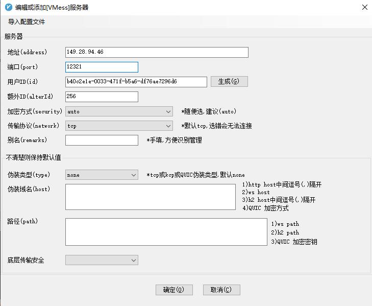

# v2ray服务器安装说明

## 服务端配置

通过scp将本文件夹目录打包移动到目标服务器

```shell
scp v2ray.zip  root@149.28.94.46:/root/
```

目标服务器安装unzip进行解压

```shell
sudo apt install unzip
unzip v2ray.zip
```

执行安装脚本

```shell
cd /root/v2ray
sudo bash v2ray_install.sh
```

等待安装完成即可。

## 客户端配置

* json文件内容

  ```json
  {
      "outbounds": [
          {
              "_QV2RAY_USE_GLOBAL_FORWARD_PROXY_": false,
              "mux": {
                  "concurrency": 8,
                  "enabled": true
              },
              "protocol": "vmess",
              "sendThrough": "0.0.0.0",
              "settings": {
                  "vnext": [
                      {
                          "address": "149.28.94.46",
                          "port": 12321,
                          "users": [
                              {
                                  "alterId": 256,
                                  "id": "b40c2e1e-0033-471f-b5a6-df76ae7296d6",
                                  "level": 0,
                                  "security": "auto",
                                  "testsEnabled": "none"
                              }
                          ]
                      }
                  ]
              },
              "streamSettings": {
                  "dsSettings": {
                      "path": "/"
                  },
                  "httpSettings": {
                      "host": [
                      ],
                      "path": ""
                  },
                  "kcpSettings": {
                      "congestion": false,
                      "downlinkCapacity": 100,
                      "header": {
                          "type": "none"
                      },
                      "mtu": 1350,
                      "readBufferSize": 2,
                      "seed": "",
                      "tti": 50,
                      "uplinkCapacity": 12,
                      "writeBufferSize": 2
                  },
                  "network": "tcp",
                  "quicSettings": {
                      "header": {
                          "type": "none"
                      },
                      "key": "",
                      "security": "none"
                  },
                  "security": "none",
                  "sockopt": {
                      "mark": 0,
                      "tcpFastOpen": false,
                      "tproxy": "off"
                  },
                  "tcpSettings": {
                      "header": {
                          "request": {
                              "headers": {
                              },
                              "method": "GET",
                              "path": [
                              ],
                              "version": "1.1"
                          },
                          "response": {
                              "headers": {
                              },
                              "reason": "OK",
                              "status": "200",
                              "version": "1.1"
                          },
                          "type": "none"
                      }
                  },
                  "tlsSettings": {
                      "allowInsecure": false,
                      "allowInsecureCiphers": false,
                      "alpn": [
                          "http/1.1"
                      ],
                      "certificates": [
                      ],
                      "disableSessionResumption": true,
                      "disableSystemRoot": false,
                      "serverName": "server.cc"
                  },
                  "wsSettings": {
                      "headers": {
                      },
                      "path": ""
                  }
              },
              "tag": "Seattle"
          }
      ]
  }
  
  ```

* window  - v2rayN

  

或者导入上方的json文件即可。

* Mac - V2RayX

  与Window类似添加即可。

  或者导入上方的json文件即可。

* Linux - Qv2ray

  以JSON文件进行编辑,将上方json文件内容复制即可。

  

  